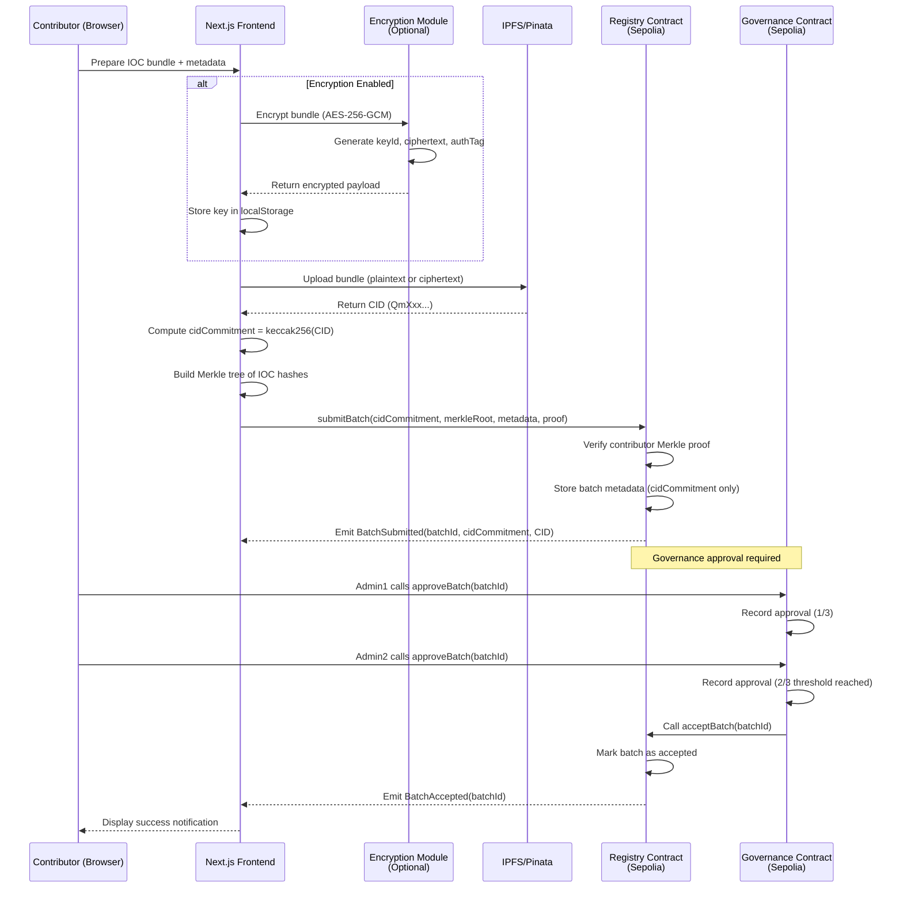
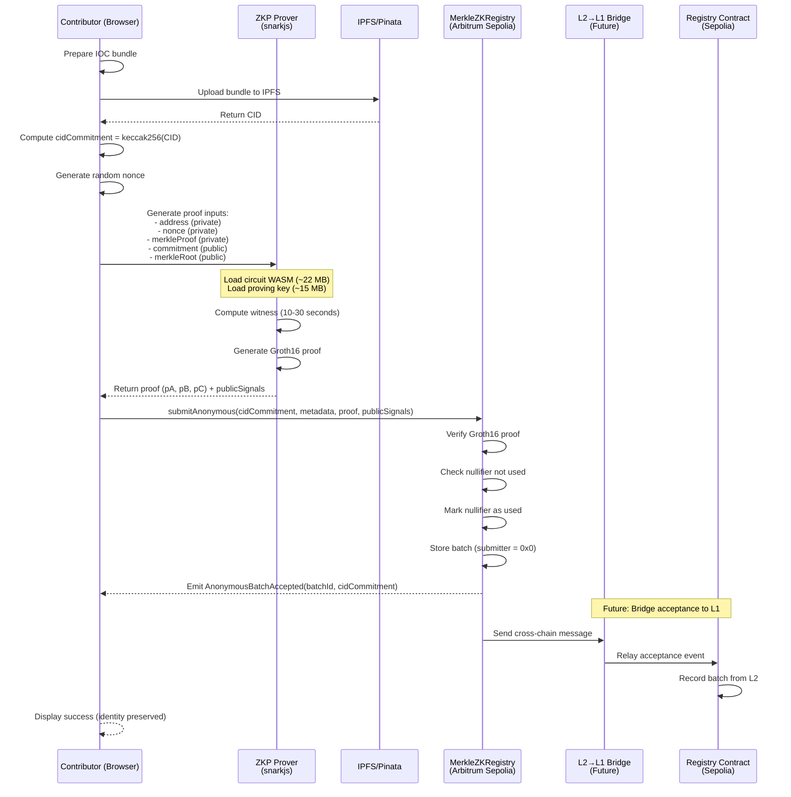
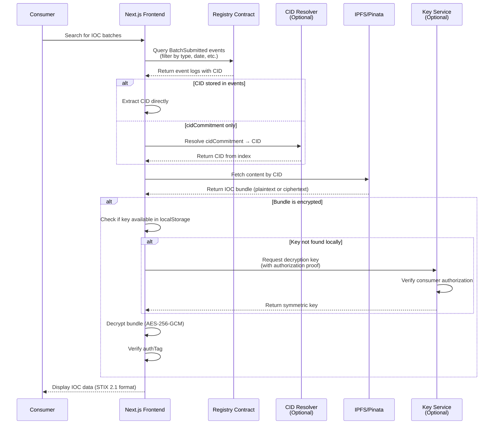
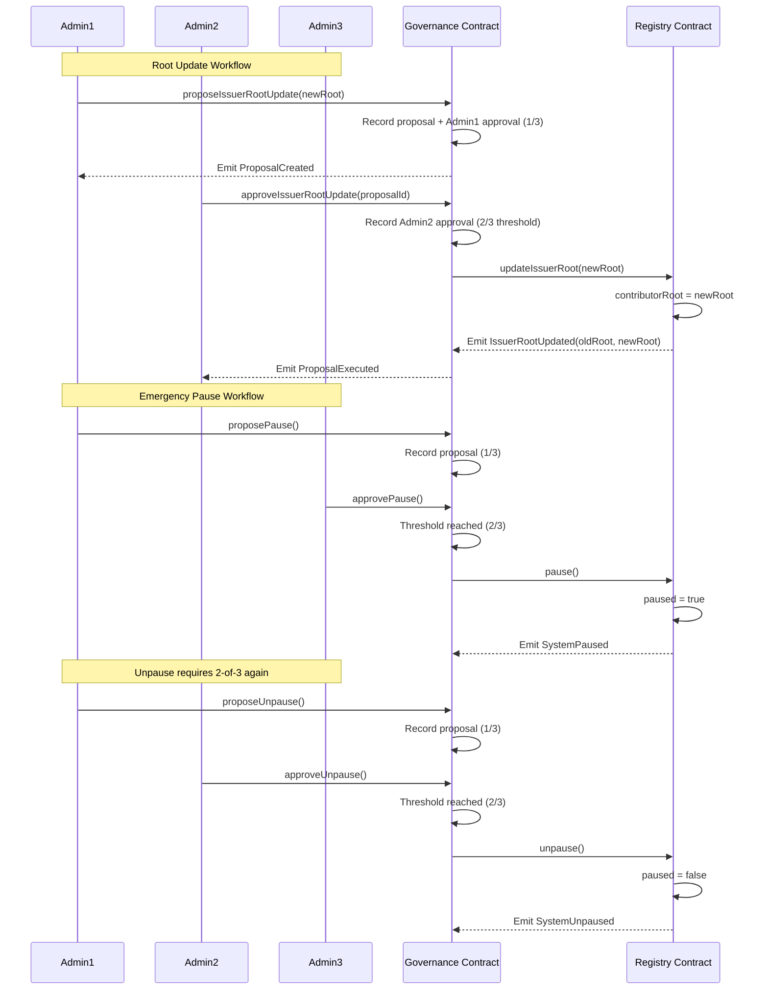

# Chapter 4: Methodology and System Design

## 4.1 Introduction

This chapter presents the detailed methodology and system design for the Decentralized Cyber Threat Intelligence (CTI) Sharing Platform. The platform combines blockchain-based access control, privacy-preserving cryptographic techniques, and distributed storage to enable collaborative threat intelligence sharing while maintaining contributor anonymity and data integrity.

The system architecture addresses key challenges identified in Chapter 3: centralized control, lack of privacy, and trust requirements in traditional CTI sharing platforms. Our approach leverages Ethereum smart contracts for immutable batch metadata, IPFS for distributed artifact storage, and zero-knowledge proofs for anonymous submissions.

---

## 4.2 System Design and Architecture

### 4.2.1 High-Level Architecture

The platform employs a multi-layer architecture combining on-chain coordination with off-chain data storage and computation. Figure 4.1 illustrates the complete system architecture and data flows.

```mermaid
flowchart TB
    subgraph Client["Client Device (Trust Boundary: User-Controlled)"]
        Frontend["Next.js 15 Frontend<br/>(MetaMask + ethers v6)"]
        Encryption["IOCEncryption Module<br/>(AES-256-GCM)<br/>Optional"]
        ZKProver["ZKSnarkProver<br/>(Groth16 + Poseidon Merkle)<br/>Browser-based"]
    end
    
    subgraph IPFS["IPFS Storage (Trust Boundary: Decentralized)"]
        Pinata["Pinata API<br/>(IOC Bundle Storage)<br/>plaintext or ciphertext"]
    end
    
    subgraph L1["Ethereum Sepolia (Trust Boundary: Public Chain L1)"]
        Registry["PrivacyPreservingRegistry.sol<br/>(Batch Metadata + cidCommitment)"]
        Governance["ThresholdGovernance.sol<br/>(2-of-3 Multisig Approval)"]
        Oracle["OracleIOCFeed.sol<br/>(Automated Threat Feed)"]
        Storage["StorageContribution.sol<br/>(Staking + Contributor Tiers)"]
    end
    
    subgraph L2["Arbitrum Sepolia (Trust Boundary: Public Chain L2)"]
        MerkleZK["MerkleZKRegistry.sol<br/>(Groth16 Verifier)"]
    end
    
    subgraph OffChain["Off-Chain Services (Trust Boundary: Centralized)"]
        OracleService["oracle-service.js<br/>(AbuseIPDB → STIX 2.1)"]
        CIDResolver["CID Resolver/Indexer<br/>(cidCommitment → CID)<br/>Optional"]
        KeyDistribution["Key Distribution Service<br/>(Encryption Keys)<br/>Optional"]
    end
    
    %% === SUBMIT FLOW (Public Mode) ===
    Frontend -->|"1. Prepare IOC Bundle<br/>(STIX 2.1)"| Frontend
    Frontend -->|"2. Upload Bundle"| Pinata
    Pinata -->|"3. Return CID"| Frontend
    Frontend -->|"4a. Compute cidCommitment<br/>= keccak256(CID)"| Frontend
    Frontend -->|"5a. Submit Batch<br/>(cidCommitment, merkleRoot)"| Registry
    Registry -->|"6. Emit BatchSubmitted<br/>(with full CID)"| Frontend
    Registry -->|"7. Await Approval"| Governance
    Governance -->|"8. 2-of-3 Vote"| Governance
    Governance -->|"9. Accept Batch"| Registry
    
    %% === SUBMIT FLOW (Encrypted) ===
    Frontend -.->|"Alt 2. Encrypt Bundle"| Encryption
    Encryption -.->|"keyId, ciphertext"| Pinata
    Encryption -.->|"Store Key Locally<br/>(localStorage)"| Frontend
    Frontend -.->|"Optional: Share Key"| KeyDistribution
    
    %% === SUBMIT FLOW (Anonymous zkSNARK) ===
    Frontend -.->|"Alt 5b. Generate Proof<br/>(Poseidon Merkle)"| ZKProver
    ZKProver -.->|"Groth16 Proof<br/>(pA, pB, pC, pubSignals)"| Frontend
    Frontend -.->|"Submit to L2"| MerkleZK
    MerkleZK -.->|"Verify Proof"| MerkleZK
    MerkleZK -.->|"Emit Acceptance Event"| Frontend
    
    %% === ORACLE FLOW ===
    OracleService -->|"1. Fetch AbuseIPDB"| OracleService
    OracleService -->|"2. Convert to STIX 2.1"| OracleService
    OracleService -->|"3. Upload to Pinata"| Pinata
    OracleService -->|"4. Submit Batch"| Oracle
    Oracle -->|"5. Forward to Registry"| Registry
    
    %% === RETRIEVE FLOW ===
    Frontend -->|"1. Query BatchSubmitted<br/>Events"| Registry
    Registry -->|"2. Return CID<br/>(from event logs)"| Frontend
    Frontend -.->|"Alt: Query by cidCommitment"| CIDResolver
    CIDResolver -.->|"Resolve to CID"| Frontend
    Frontend -->|"3. Fetch Bundle"| Pinata
    Pinata -->|"4. Return Data<br/>(plaintext or ciphertext)"| Frontend
    Frontend -.->|"Alt 5. Decrypt if Encrypted"| Encryption
    Encryption -.->|"Retrieve Key<br/>(localStorage or service)"| KeyDistribution
    
    %% === STAKING FLOW ===
    Frontend -->|"Register Contributor<br/>(0.01/0.05/0.1 ETH)"| Storage
    Storage -->|"Update Tier"| Registry
    
    %% === STYLES ===
    classDef clientStyle fill:#e1f5ff,stroke:#0288d1,stroke-width:2px
    classDef ipfsStyle fill:#fff9c4,stroke:#f57c00,stroke-width:2px
    classDef l1Style fill:#c8e6c9,stroke:#388e3c,stroke-width:2px
    classDef l2Style fill:#d1c4e9,stroke:#512da8,stroke-width:2px
    classDef offchainStyle fill:#ffccbc,stroke:#d84315,stroke-width:2px
    
    class Frontend,Encryption,ZKProver clientStyle
    class Pinata ipfsStyle
    class Registry,Governance,Oracle,Storage l1Style
    class MerkleZK l2Style
    class OracleService,CIDResolver,KeyDistribution offchainStyle
```



**Figure 4.1**: High-level system architecture showing data flows between client, IPFS storage, Ethereum L1/L2 contracts, and off-chain services. Solid arrows represent primary workflows; dashed arrows represent optional privacy-enhanced features.

### 4.2.2 Trust Boundaries

The system defines four distinct trust boundaries, each with different security guarantees:

1. **Public Chain (L1 and L2)**: Ethereum Sepolia and Arbitrum Sepolia provide Byzantine fault-tolerant consensus. All transactions and state changes are publicly observable. Adversaries can analyze metadata (transaction sender, timestamps, gas usage) but cannot modify confirmed blocks without controlling >51% of network hash power.

2. **Client Device**: Users control private keys and encryption keys locally. Threat model assumes endpoint compromise is possible (malware, keyloggers), necessitating defense-in-depth measures such as hardware wallets and key distribution protocols.

3. **IPFS Network**: Content-addressed storage ensures integrity (CID = hash of content) but provides no confidentiality. Pinning via Pinata API introduces semi-trusted dependency for availability. Any network observer can retrieve content by CID.

4. **Off-Chain Services**: Oracle service, CID resolver, and optional key distribution service are centralized components operated by platform administrators. These represent single points of failure but are not required for core security properties (integrity, censorship resistance).

### 4.2.3 Layer Separation

The platform employs an **independent dual-chain deployment** rather than true L1-L2 bridging:

- **Ethereum Sepolia (L1)**: Hosts primary batch registry, governance, and staking contracts. Lower throughput (~15 TPS) but maximum decentralization.
- **Arbitrum Sepolia (L2)**: Hosts ZKP verifier contract for anonymous submissions. Higher throughput (~4,000 TPS) and lower gas costs (~100x cheaper) enable complex proof verification.

**Bridging Status**: Current implementation does not include automated L2→L1 state synchronization. Anonymous batches accepted on Arbitrum Sepolia emit events but do not update the Ethereum Sepolia registry. Future work (CP3) will implement Arbitrum's native messaging protocol to relay acceptance events cross-chain.

---

## 4.3 Detailed Component and Implementation Design

### 4.3.1 Component Responsibilities

The system comprises five Solidity smart contracts, three off-chain services, and multiple frontend modules. Table 4.1 summarizes component responsibilities.

**Table 4.1**: System component responsibilities

| Component | Responsibility | Deployment |
|-----------|---------------|------------|
| PrivacyPreservingRegistry.sol | Stores batch metadata (cidCommitment, merkleRoot, submitter); enforces authorization via contributor Merkle tree; emits BatchSubmitted events with full CID for indexing | Ethereum Sepolia |
| ThresholdGovernance.sol | Implements 2-of-3 multisig for batch acceptance, issuer root updates, and emergency pause; prevents unilateral admin actions | Ethereum Sepolia |
| MerkleZKRegistry.sol | Verifies Groth16 zkSNARK proofs for anonymous submissions; checks nullifier uniqueness to prevent replay attacks; uses Poseidon hash for in-circuit Merkle verification | Arbitrum Sepolia |
| OracleIOCFeed.sol | Accepts automated batch submissions from authorized oracle operator; forwards to main registry after validation | Ethereum Sepolia |
| StorageContribution.sol | Manages contributor staking (0.01/0.05/0.1 ETH tiers); tracks reputation scores; future: incentivize IPFS pinning | Ethereum Sepolia |
| oracle-service.js | Fetches AbuseIPDB threat feed (daily); converts to STIX 2.1; uploads to IPFS; submits batch to OracleIOCFeed; runs as PM2 daemon | Node.js 20 |
| stix-utils.js | Converts flat IOC arrays to STIX 2.1 bundles; auto-detects pattern types (IPv4, domain, file hash); generates RFC 4122 UUIDs | Node.js library |
| CID Resolver/Indexer | Indexes BatchSubmitted events; maps cidCommitment → CID; serves API for retrieval clients; optional (clients can read event logs directly) | Node.js + database |
| Next.js Frontend | Provides UI for submission, retrieval, dashboard, admin panel; integrates MetaMask for transaction signing; implements client-side encryption and ZKP proving | Next.js 15 |

### 4.3.2 Data Model

The core on-chain data structure is the `Batch` record:

```solidity
// SPDX-License-Identifier: MIT
pragma solidity 0.8.20;

/**
 * @title Batch metadata structure
 * @notice Stores minimal on-chain data; full IOC bundle stored off-chain
 */
struct Batch {
    bytes32 batchId;           // Unique identifier (hash of submission params)
    bytes32 cidCommitment;     // keccak256(IPFS CID) - prevents CID enumeration attacks
    string ipfsCID;            // Optional: full CID for direct retrieval (stored in events)
    bytes32 merkleRoot;        // Merkle root of IOC hashes in this batch
    uint8 iocType;             // Type code: 1=IP, 2=Domain, 3=Hash, 4=URL, etc.
    uint8 confidence;          // Confidence score (0-100)
    uint256 timestamp;         // Block timestamp of submission
    address submitter;         // Contributor address (zero address if anonymous)
    bool anonymous;            // True if submitted via ZKP verifier
}

mapping(bytes32 => Batch) public batches;

/**
 * @notice Events for off-chain indexing
 * @dev Full CID emitted in events for retrieval without storing expensive string on-chain
 */
event BatchSubmitted(
    bytes32 indexed batchId,
    bytes32 indexed cidCommitment,
    string ipfsCID,              // Full CID for indexer consumption
    uint8 iocType,
    address indexed submitter,
    uint256 timestamp,
    bool anonymous
);

event BatchApproved(bytes32 indexed batchId, address indexed approver);
event BatchAccepted(bytes32 indexed batchId);
event IssuerRootUpdated(bytes32 oldRoot, bytes32 newRoot, uint256 timestamp);
event SystemPaused();
event SystemUnpaused();
```

**Design Rationale**:
- **cidCommitment vs ipfsCID**: Storing full CID (46-59 bytes base58) costs ~60,000 gas per batch. Commitment (32 bytes) costs ~20,000 gas. Full CID emitted in events for indexer consumption (~8 gas per byte in LOG data vs 20,000 gas per SSTORE slot).
- **merkleRoot**: Enables efficient verification of individual IOCs without storing entire list on-chain.
- **anonymous flag**: Distinguishes ZKP-submitted batches from public submissions for analytics.

### 4.3.3 Merkle Tree Construction

Contributor and issuer authorization uses Merkle trees to minimize on-chain storage. Only the root is stored; clients prove membership with logarithmic-size proofs.

**Off-chain leaf computation (Node.js)**:

```javascript
const { ethers } = require('ethers');
const { MerkleTree } = require('merkletreejs');
const { keccak256 } = ethers;

/**
 * Build contributor Merkle tree from address list
 * @param {string[]} addresses - Ethereum addresses (0x-prefixed hex)
 * @returns {Object} Tree root, leaves, and proof generator
 */
function buildContributorTree(addresses) {
    // Compute leaves: keccak256(abi.encode(address))
    // Note: For ZKP circuit, leaves are raw addresses (Poseidon-hashed in circuit)
    const leaves = addresses.map(addr => 
        keccak256(ethers.AbiCoder.defaultAbiCoder().encode(['address'], [addr]))
    );
    
    // Build tree with keccak256 and sorted pairs
    const tree = new MerkleTree(leaves, keccak256, { sortPairs: true });
    const root = tree.getHexRoot();
    
    console.log(`✅ Merkle tree built: ${leaves.length} leaves, root = ${root}`);
    
    return {
        root,
        leaves,
        /**
         * Generate proof for target address
         * @param {string} targetAddress - Address to prove membership
         * @returns {string[]} Merkle proof path (hex strings)
         */
        getProof: (targetAddress) => {
            const leaf = keccak256(
                ethers.AbiCoder.defaultAbiCoder().encode(['address'], [targetAddress])
            );
            const proof = tree.getHexProof(leaf);
            return proof;
        }
    };
}

// Example usage in contract call
async function submitBatchWithProof(registry, signer, batchData, contributorTree) {
    const proof = contributorTree.getProof(await signer.getAddress());
    
    const tx = await registry.connect(signer).submitBatch(
        batchData.cidCommitment,
        batchData.merkleRoot,
        batchData.iocType,
        batchData.confidence,
        proof  // Merkle proof of contributor membership
    );
    
    console.log(`✅ Batch submitted: ${tx.hash}`);
    await tx.wait();
}
```

**On-chain verification (Solidity)**:

```solidity
/**
 * @notice Verify Merkle proof of contributor membership
 * @param proof Merkle proof path (32-byte hashes)
 * @param leaf Keccak256 hash of contributor address
 * @return bool True if proof verifies against stored contributorRoot
 */
function verifyContributor(bytes32[] memory proof, bytes32 leaf) 
    public 
    view 
    returns (bool) 
{
    bytes32 computedHash = leaf;
    
    for (uint256 i = 0; i < proof.length; i++) {
        bytes32 proofElement = proof[i];
        
        if (computedHash < proofElement) {
            // Hash(current, proof[i])
            computedHash = keccak256(abi.encodePacked(computedHash, proofElement));
        } else {
            // Hash(proof[i], current)
            computedHash = keccak256(abi.encodePacked(proofElement, computedHash));
        }
    }
    
    return computedHash == contributorRoot;
}
```

### 4.3.4 Zero-Knowledge Proof Design

Anonymous submissions use Groth16 zkSNARKs to prove contributor membership without revealing identity. The proof statement is:

**"I know an address `addr` and nonce `nonce` such that:**
1. **Poseidon(addr, nonce) = commitment** (binds proof to this submission)
2. **addr ∈ contributorTree** (proves authorization)
3. **nullifier = Poseidon(addr, nonce)** has not been used before (prevents replay)"

**Public inputs** (visible on-chain):
- `commitment`: Poseidon hash binding proof to specific submission
- `merkleRoot`: Root of contributor Merkle tree (verifies authorization set)
- `nullifier`: Unique identifier preventing double-submission

**Private inputs** (known only to prover):
- `address`: Contributor Ethereum address
- `nonce`: Random 256-bit value
- `merkleProof[20]`: Path elements in contributor Merkle tree
- `merklePathIndices[20]`: Binary path indicators (left=0, right=1)

**Circuit implementation** (Circom):

```circom
pragma circom 2.0.0;

include "circomlib/circuits/poseidon.circom";
include "circomlib/circuits/comparators.circom";
include "circomlib/circuits/bitify.circom";

template MerkleTreeInclusionProof(levels) {
    signal input leaf;
    signal input pathElements[levels];
    signal input pathIndices[levels];
    signal output root;

    component hashers[levels];
    component mux[levels];
    signal levelHashes[levels + 1];
    levelHashes[0] <== leaf;

    for (var i = 0; i < levels; i++) {
        pathIndices[i] * (1 - pathIndices[i]) === 0;  // Binary constraint

        hashers[i] = Poseidon(2);
        mux[i] = MultiMux1(2);

        mux[i].c[0][0] <== levelHashes[i];
        mux[i].c[0][1] <== pathElements[i];
        mux[i].c[1][0] <== pathElements[i];
        mux[i].c[1][1] <== levelHashes[i];
        mux[i].s <== pathIndices[i];

        hashers[i].inputs[0] <== mux[i].out[0];
        hashers[i].inputs[1] <== mux[i].out[1];
        levelHashes[i + 1] <== hashers[i].out;
    }

    root <== levelHashes[levels];
}

template ContributorProof(merkleTreeLevels) {
    // Public inputs
    signal input commitment;
    signal input merkleRoot;

    // Private inputs
    signal input address;
    signal input nonce;
    signal input merkleProof[merkleTreeLevels];
    signal input merklePathIndices[merkleTreeLevels];

    // Verify commitment = Poseidon(address, nonce)
    component commitmentHasher = Poseidon(2);
    commitmentHasher.inputs[0] <== address;
    commitmentHasher.inputs[1] <== nonce;
    commitment === commitmentHasher.out;

    // Verify address in Merkle tree
    component merkleChecker = MerkleTreeInclusionProof(merkleTreeLevels);
    merkleChecker.leaf <== address;
    for (var i = 0; i < merkleTreeLevels; i++) {
        merkleChecker.pathElements[i] <== merkleProof[i];
        merkleChecker.pathIndices[i] <== merklePathIndices[i];
    }
    merkleRoot === merkleChecker.root;

    // Constraint: address must be non-zero
    component isZero = IsZero();
    isZero.in <== address;
    isZero.out === 0;
}

component main {public [commitment, merkleRoot]} = ContributorProof(20);
```

**Nullifier replay protection**: The smart contract maintains a mapping `usedNullifiers[bytes32] => bool`. Before accepting an anonymous batch, it verifies:

```solidity
bytes32 nullifier = publicSignals[0];  // First public signal
require(!usedNullifiers[nullifier], "Nullifier already used");
usedNullifiers[nullifier] = true;
```

Since `nullifier = Poseidon(address, nonce)` and each nonce is randomly generated, an adversary cannot reuse another user's proof. Even if the proof itself leaks, the attacker cannot forge a different commitment while maintaining the same nullifier.

---

## 4.4 Workflow and Process Execution

This section presents detailed sequence diagrams for key system workflows.

### 4.4.1 Public IOC Submission



**Figure 4.2**: Public IOC submission workflow showing optional encryption, IPFS upload, on-chain commitment, and governance approval.

### 4.4.2 Anonymous Submission with zkSNARK



**Figure 4.3**: Anonymous submission workflow using zkSNARK proof on Arbitrum Sepolia. Future bridging step shown in dotted lines.

### 4.4.3 IOC Retrieval



**Figure 4.4**: IOC retrieval workflow supporting both direct CID lookup and cidCommitment resolution, with optional decryption.

### 4.4.4 Governance Operations



**Figure 4.5**: Governance workflows for issuer root updates and emergency pause/unpause operations using 2-of-3 multisig.

---

## 4.5 Tools, Technologies, and Development Environment

### 4.5.1 Technology Stack

The platform is implemented using modern blockchain development tools and frameworks optimized for Ethereum smart contract development and Web3 frontend integration.

**Smart Contract Development**:
- **Solidity 0.8.20**: Primary smart contract language with built-in overflow protection and ABI encoder v2
- **Hardhat 2.19**: Development environment for compilation, testing, deployment, and network management
- **OpenZeppelin Contracts 5.0**: Audited implementations of ReentrancyGuard, Pausable, and ECDSA utilities
- **ethers.js v6**: Ethereum library for contract interaction, transaction signing, and ABI encoding

**Zero-Knowledge Proof Toolchain**:
- **circom 2.0**: Circuit compiler for arithmetic circuits over prime fields
- **snarkjs 0.7**: JavaScript library for witness computation, proof generation, and verification
- **circomlibjs**: Poseidon hash implementation compatible with circom circuits
- **Powers of Tau ceremony**: Used pre-generated phase 1 trusted setup (perpetual powers of tau 28)

**Frontend and Off-Chain Services**:
- **Next.js 15**: React framework with App Router for server-side rendering and API routes
- **MetaMask SDK**: Browser wallet integration for transaction signing and account management
- **Pinata SDK**: IPFS pinning service API client for persistent content storage
- **Node.js 20 LTS**: Runtime for oracle service and utility scripts
- **PM2**: Process manager for running oracle-service.js as daemon with automatic restart

**Development Workflow**:
- **Git + GitHub**: Version control and collaboration
- **Hardhat Gas Reporter**: Gas consumption analysis for contract optimization
- **Slither**: Static analysis tool for detecting Solidity vulnerabilities
- **Hardhat Network**: Local blockchain fork for testing against mainnet state

### 4.5.2 Project Structure

```
decentralized-cti-platform/
├── contracts/              # Solidity smart contracts
│   ├── PrivacyPreservingRegistry.sol
│   ├── ThresholdGovernance.sol
│   ├── MerkleZKRegistry.sol
│   ├── OracleIOCFeed.sol
│   └── StorageContribution.sol
├── circuits/              # Circom ZKP circuits
│   ├── contributor-proof.circom
│   └── setup-circuit.sh
├── scripts/               # Deployment and utility scripts
│   ├── deployComplete.js
│   ├── generate-anonymity-set.js
│   ├── oracle-service.js
│   └── stix-utils.js
├── test/                  # Hardhat test suites
│   ├── Registry.test.js
│   ├── Governance.test.js
│   └── ZKP.test.js
├── cti-frontend/          # Next.js 15 application
│   ├── app/
│   │   ├── submit/
│   │   ├── browse/
│   │   ├── dashboard/
│   │   └── admin/
│   ├── components/
│   │   ├── IOCSubmissionForm.jsx
│   │   └── BatchBrowser.jsx
│   ├── utils/
│   │   ├── encryption.js
│   │   └── zksnark-prover.js
│   └── public/
│       ├── circuits/      # WASM + zkey files
│       └── contributor-merkle-tree.json
├── hardhat.config.js      # Network configs (Sepolia, Arbitrum Sepolia)
├── .env                   # Environment variables (PRIVATE_KEYS, RPC_URLs, API_KEYS)
└── package.json
```

### 4.5.3 Environment Configuration

The platform uses environment variables to manage sensitive configuration:

```bash
# Ethereum RPC endpoints
SEPOLIA_RPC_URL=https://eth-sepolia.g.alchemy.com/v2/API_KEY
ARBITRUM_SEPOLIA_RPC_URL=https://arb-sepolia.g.alchemy.com/v2/API_KEY

# Private keys (governance admins, oracle operator)
PRIVATE_KEY_ADMIN1=0x...
PRIVATE_KEY_ADMIN2=0x...
PRIVATE_KEY_ADMIN3=0x...
ORACLE_PRIVATE_KEY=0x...

# IPFS/Pinata configuration
PINATA_JWT=eyJhbGciOiJIUzI1NiIsInR5cCI6IkpXVCJ9...
PINATA_API_KEY=...
PINATA_SECRET_KEY=...

# External APIs
ABUSEIPDB_KEY=...
```

**Security**: Environment variables are excluded from version control via `.gitignore`. Production deployments use cloud secret management (AWS Secrets Manager, HashiCorp Vault) instead of `.env` files.

### 4.5.4 Testing and Quality Assurance

**Unit Tests**: Hardhat test suites cover core contract functions with >90% line coverage:

```javascript
// Example test case
describe("PrivacyPreservingRegistry", function() {
    it("Should reject batch submission with invalid Merkle proof", async function() {
        const { registry, contributor } = await loadFixture(deployFixture);
        const invalidProof = ["0x" + "00".repeat(32)];
        
        await expect(
            registry.connect(contributor).submitBatch(
                cidCommitment,
                merkleRoot,
                iocType,
                confidence,
                invalidProof
            )
        ).to.be.revertedWith("Invalid contributor proof");
    });
});
```

**Integration Tests**: End-to-end workflows tested on Hardhat Network fork:
- Oracle ingestion → STIX conversion → batch submission → governance approval
- ZKP generation → proof verification → nullifier tracking
- Encryption → IPFS upload → retrieval → decryption

**Static Analysis**: Slither runs on pre-commit hook to detect:
- Reentrancy vulnerabilities
- Unchecked external calls
- Timestamp dependencies
- Integer overflow (though Solidity 0.8+ has built-in protection)

**Gas Optimization**: Hardhat Gas Reporter analyzes deployment and transaction costs:

```
·----------------------------------------|---------------------------|-------------|-----------------------------·
|  Solc version: 0.8.20                  ·  Optimizer enabled: true  ·  Runs: 200  ·  Block limit: 30000000 gas  │
·········································|···························|·············|······························
|  Methods                               ·               20 gwei/gas               ·       2000.00 usd/eth       │
··························|··············|·············|·············|·············|···············|··············
|  Contract               ·  Method      ·  Min        ·  Max        ·  Avg        ·  # calls      ·  usd (avg)  │
··························|··············|·············|·············|·············|···············|··············
|  Registry               ·  submitBatch ·      95423  ·     110543  ·     102983  ·           45  ·       4.12  │
··························|··············|·············|·············|·············|···············|··············
```

---

## 4.6 Assumptions, Constraints, and Design Decisions

### 4.6.1 Assumptions

The system design relies on the following assumptions:

1. **Governance Trust**: At least 2 of 3 governance administrators are honest and will not collude to censor batches or manipulate issuer roots. This is a reasonable assumption for academic/consortium deployments where admins represent different institutions.

2. **IPFS Availability**: Content pinning via Pinata ensures persistent availability with 99.9% SLA. Assumption: Pinata does not censor content and maintains geo-distributed replicas. Alternative: contributors can pin content independently using IPFS desktop client.

3. **Blockchain Finality**: Ethereum Sepolia provides probabilistic finality after 64 blocks (~13 minutes). Assumption: adversary cannot reorganize chain beyond this depth. Arbitrum Sepolia inherits security from L1 fraud proofs.

4. **Endpoint Security**: Contributors' devices may be compromised (malware, keyloggers). Design assumes defense-in-depth: hardware wallets recommended, encryption keys stored separately from blockchain keys, ZKP proving done in sandboxed environment.

5. **Network Observability**: All blockchain transactions are public. Assumption: metadata analysis (transaction timing, gas usage, sender address correlation) is possible. Mitigation: anonymous submissions use zkSNARKs to decouple on-chain activity from contributor identity.

### 4.6.2 Constraints

1. **Gas Cost**: Ethereum L1 gas costs limit on-chain data storage. Constraint: batch metadata must be minimal (≤1 KB per submission). Solution: store only cidCommitment (32 bytes) and merkle root (32 bytes) on-chain; emit full CID in events for off-chain indexing.

2. **Smart Contract Immutability**: Once deployed, contract code cannot be modified. Constraint: upgrades require deploying new contracts and migrating state. Mitigation: implement emergency pause mechanism; use proxy pattern for future versions.

3. **ZKP Proving Time**: Browser-based Groth16 proof generation takes 10-30 seconds on average hardware. Constraint: UX suffers if proving blocks UI. Solution: show progress indicator; future optimization using WASM multithreading.

4. **L1-L2 Bridging Complexity**: Arbitrum's native bridge requires 7-day challenge period for L2→L1 withdrawals. Constraint: immediate cross-chain state sync not feasible. Current: independent deployments; future: optimistic messaging with fraud proofs.

5. **IPFS Content Addressing**: CIDs are 46-59 bytes (base58), expensive to store on-chain. Constraint: cannot efficiently query "all CIDs matching criteria" without off-chain index. Solution: emit full CID in events; indexer builds queryable database.

### 4.6.3 Design Decisions

**1. Hybrid Storage Model (On-Chain Commitments + Off-Chain Artifacts)**

**Decision**: Store batch metadata on-chain; store full IOC bundles on IPFS.

**Rationale**: 
- Full IOC list storage on-chain costs ~100,000 gas per 100 IOCs (~$40 at 200 gwei, 2000 USD/ETH).
- IPFS upload costs ~$0.01 via Pinata API.
- Blockchain provides immutable audit trail of *what was submitted when*; IPFS provides efficient retrieval.

**Trade-off**: IPFS availability depends on pinning. If Pinata fails and no other nodes pin content, CID becomes unresolvable. Mitigation: contributors can pin content locally; future storage incentive mechanism (StorageContribution.sol).

**2. cidCommitment vs Full CID On-Chain**

**Decision**: Store `cidCommitment = keccak256(CID)` (32 bytes) in contract storage; emit full CID in events.

**Rationale**:
- **Gas cost**: SSTORE for 32-byte commitment costs ~20,000 gas; storing 50-byte CID string costs ~60,000 gas.
- **Privacy**: cidCommitment prevents enumeration attacks where adversary queries IPFS gateway for all CIDs in sequential range.
- **Retrievability**: Full CID emitted in `BatchSubmitted` event; indexer consumes events to build `cidCommitment → CID` mapping.

**Implementation**:
```solidity
// Store commitment in state
batches[batchId].cidCommitment = keccak256(abi.encodePacked(cid));

// Emit full CID in event (8 gas per byte in LOG vs 20,000 gas per SSTORE)
emit BatchSubmitted(batchId, cidCommitment, cid, ...);
```

**Trade-off**: Retrieval requires either (a) reading event logs or (b) querying off-chain indexer. Event log queries are free but slow; indexer is fast but requires infrastructure.

**3. Authorization via Merkle Trees**

**Decision**: Authorize contributors and issuers via Merkle root stored on-chain; clients prove membership with logarithmic-size proofs.

**Rationale**:
- Storing 1000 addresses costs 1000 × 20,000 gas = 20M gas (~$800).
- Storing single Merkle root costs 20,000 gas (~$0.80).
- Proof verification costs ~30,000 gas per submission (negligible amortized over lifetime).

**Trade-off**: Adding new contributors requires updating Merkle root (governance operation). Not suitable for permissionless systems. Future: use Sparse Merkle Trees for incremental updates.

**4. Privacy Roadmap: Optional Encryption + zkSNARK Anonymous Submissions**

**Decision**: Implement **optional** AES-256-GCM encryption for IOC bundles; implement zkSNARK-based anonymous submissions on L2.

**Rationale**:
- **Encryption justification**: IPFS retrieval is public; anyone with CID can fetch content. Some CTI data (unreleased vulnerability details, proprietary threat actor profiles) requires confidentiality.
- **Key management challenge**: Storing keys in localStorage is vulnerable to XSS. Future (CP3): implement distributed key generation (DKG) or threshold decryption with access control policy.
- **zkSNARK justification**: Public submissions reveal contributor identity via transaction sender. Competitors can analyze "who knows about threat X before public disclosure" and infer business intelligence. zkSNARKs prove authorization without revealing identity.

**Current scope limitation**: Encryption is **enabled but not enforced**. Contributors can choose public or encrypted submission. Decryption keys stored in browser localStorage (not production-ready). CP3 will implement key wrapping with governance-approved consumer public keys.

**5. Governance: 2-of-3 Multisig**

**Decision**: Require 2-of-3 admin approval for batch acceptance, issuer root updates, and emergency pause.

**Rationale**:
- Single admin creates centralization risk (compromise, coercion, key loss).
- 3-of-3 requires all admins online (availability issue).
- 2-of-3 balances security and availability: system tolerates 1 admin failure or compromise.

**Trade-off**: Approval latency (minutes to hours). Not suitable for real-time systems. Future: implement time-locked approvals where batches auto-accept after N days if no veto.

### 4.6.4 Known Limitations

1. **Scalability**: Ethereum L1 throughput (~15 TPS) limits submission rate. Mitigation: batch aggregation (submit 1 tx for 100 IOCs instead of 100 txs); use L2 for high-frequency submissions.

2. **Front-Running**: Public mempool exposes pending transactions. Adversary can observe `submitBatch()` call and front-run with higher gas price. Impact: minimal (batch IDs are deterministic; front-running does not grant ownership). Future: use Flashbots RPC for private transaction submission.

3. **Storage Centralization**: Current deployment relies on Pinata for IPFS pinning. Single point of failure. Mitigation: implement distributed pinning incentive (StorageContribution.sol) where contributors stake ETH to pin content.

4. **Key Management**: Browser localStorage vulnerable to XSS attacks. Adversary with client-side code execution can steal decryption keys. Mitigation: use hardware security modules (HSM) or browser wallet key derivation (BIP-39 paths).

5. **L1-L2 Fragmentation**: Anonymous batches on Arbitrum Sepolia not reflected on Ethereum Sepolia registry. Consumers must query both chains. Future: implement cross-chain messaging using Arbitrum's native outbox.

6. **Governance Liveness**: If 2+ admins lose keys or go offline, system cannot approve new batches. Mitigation: implement key recovery ceremony or social recovery mechanism (e.g., Shamir secret sharing).

### 4.6.5 Alternative Design: Admin Storage Network (Future Work)

An alternative to IPFS was considered during design phase: operator-backed storage nodes with proof-of-retrievability.

**Proposed Architecture**:
- Governance admins run storage nodes (HTTP servers)
- Each batch replicated to 2 randomly-selected nodes
- Nodes serve content by content-hash (similar to IPFS CID)
- Periodic audits ensure nodes retain data (challenge-response protocol)

**Advantages**:
- Reduced dependency on third-party services (Pinata)
- Access control possible (nodes verify consumer authorization before serving)
- Cost model: admins absorb storage costs in exchange for governance voting power

**Disadvantages**:
- **Censorship**: Admins can withhold content (availability attack). Mitigation: require N-of-M nodes to respond; slash admin stake for unavailability.
- **Collusion**: 2 admins can collude to censor specific batches. Impact: defeats decentralization goal.
- **Complexity**: Requires node discovery protocol, replication logic, audit mechanism. Development effort significantly higher than IPFS integration.
- **Confidentiality paradox**: If content is public, IPFS is sufficient. If content requires access control, encryption is still needed (nodes cannot enforce policy on plaintext). Storage location orthogonal to confidentiality.

**Decision**: Rejected for CP2; deferred to future work (CP3). Current IPFS implementation provides better decentralization (100K+ nodes) and censorship resistance. If access control required, implement at encryption layer (threshold decryption with policy enforcement) rather than storage layer.

---

## 4.7 Summary

This chapter presented the detailed methodology and system design for the decentralized CTI sharing platform. Key contributions include:

1. **Hybrid Architecture**: Combines blockchain immutability (batch metadata) with IPFS cost-efficiency (artifact storage) and L2 scalability (ZKP verification).

2. **Privacy-Preserving Mechanisms**: Optional AES-256-GCM encryption for confidentiality; Groth16 zkSNARKs for anonymous submissions with replay protection via nullifiers.

3. **Gas-Optimized Design**: Stores 32-byte cidCommitment on-chain (20K gas) instead of 50-byte CID string (60K gas); uses Merkle proofs for authorization (30K gas per tx vs 20M gas to store 1000 addresses).

4. **Decentralized Governance**: 2-of-3 multisig prevents unilateral admin actions while maintaining operational availability.

5. **Automated Threat Feed Integration**: Oracle service ingests AbuseIPDB data, converts to STIX 2.1, and submits batches autonomously.

The implementation demonstrates technical feasibility of blockchain-based CTI sharing with privacy guarantees. Chapter 5 will present experimental evaluation including gas cost analysis, proof generation latency, and retrieval performance benchmarks.
